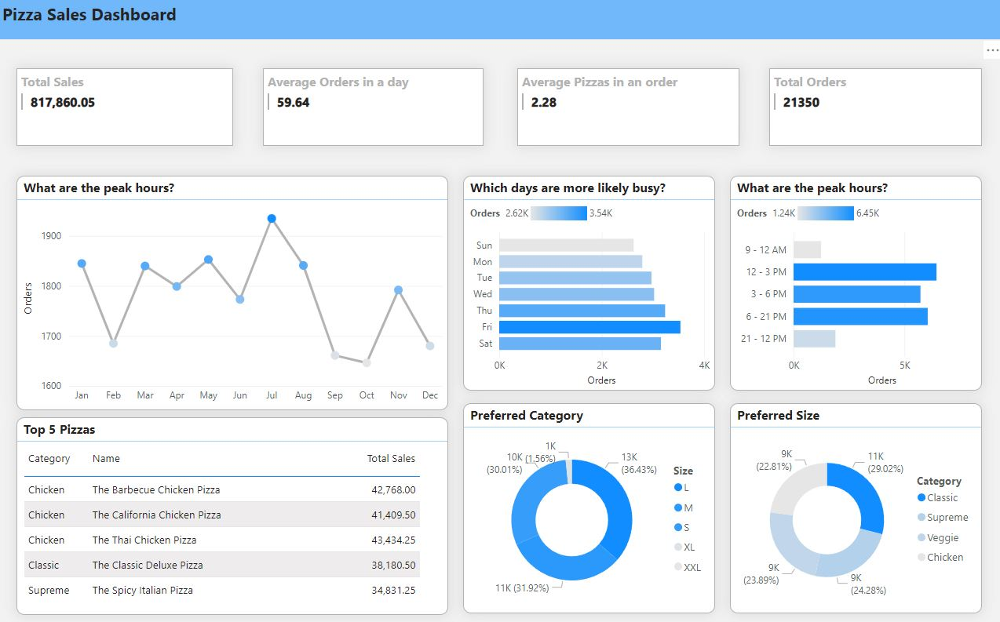

#### Pizza, Place, and Sales Analysis ####
A year's worth of sales from a fictitious pizza place, including the date and time of each order and the pizzas served, with additional details on the type, size, quantity, price, and ingredients.

The data is collected from [mavenanalytics](https://www.mavenanalytics.io/data-playground)

The dashboard aims to answer the following queries:
  - How many customers do we have each day? Are there any peak hours?
  - How many pizzas are typically in an order? Do we have any bestsellers?
  - How much money did we make this year? Can we identify any seasonality in the sales?
  - Are there any pizzas we should take off the menu, or any promotions we could leverage?

#### Dashboard ####

